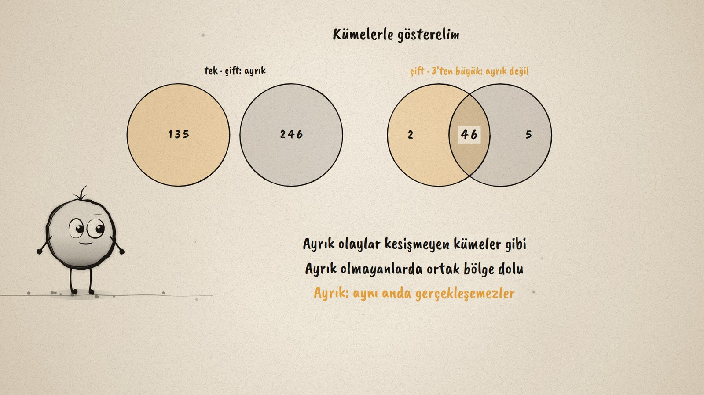
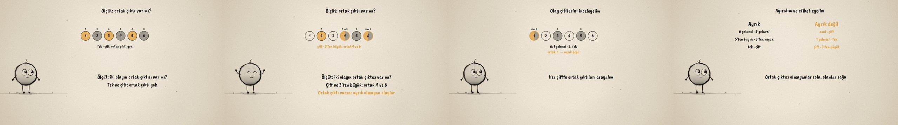

# Ortak Çıktı Var mı? · Disjoint and Overlapping Events

**▶ Tarayıcıda izleyin / Watch in the browser:** https://hakanatas.github.io/ortak-cikti/ 
**⬇ MP4 + altyazılar / MP4 + subtitles:** [Releases](https://github.com/hakanatas/ortak-cikti/releases) 
**✎ Kullanılan istem / The prompt behind it:** [PROMPT.md](PROMPT.md) 
**🎞 Bütün filmler / All films:** [Nokta'nın Filmleri](https://hakanatas.github.io/nokta-filmleri/?sinif=7)

> **TR —** 7. sınıf matematik "Veriden Olasılığa" temasındaki MAT.7.7.3 öğrenme çıktısı için hazırlanmış, tamamen JavaScript ile çizilen 92 saniyelik mürekkep animasyonu. Bir zar atılıyor; A: çift sayı gelmesi, B: 3'ten büyük gelmesi. 4 ve 6 iki olayda da var. Ölçüt belirleniyor: iki olayın ortak çıktısı var mı? Tek ve çift gelmesinin ortak çıktısı yok, ayrık olaylar; çift ve 3'ten büyük gelmesi 4 ve 6'da ortak, ayrık olmayan olaylar. Dört olay çifti daha inceleniyor (6 ve 5, asal ve çift, 1 ve tek, 5'ten büyük ve 3'ten küçük), ortak çıktılara göre iki sütuna ayrılıp etiketleniyor. Son olarak kümelerle gösteriliyor: ayrık olaylar kesişmeyen kümeler gibi ve aynı anda gerçekleşemez. Altyazılar Türkçe, İngilizce ya da ikisi birlikte seçilebilir.

A 92-second ink animation for **7th-grade maths**. Nokta, the ink character from [The Learning Ink](https://github.com/hakanatas/the-learning-ink), is the guide again. Each pair of events is two small sets in `scenes/scene1.js`; the half-and-half outcomes on the die, the verdict under the row and the column each pair lands in all come from one test, whether the two sets share an outcome.

## Learning outcome

MEB, Türkiye Yüzyılı Maarif Modeli, Ortaokul Matematik, 7th grade, "Veriden Olasılığa" theme:

**MAT.7.7.3. Olayları ayrık olma ve ayrık olmama durumlarına göre sınıflandırabilme**
- a) Olayların ayrık olma ve ayrık olmama durumlarını olaylara ait çıktıların ortak olup olmamasını ölçüt alarak belirler.
- b) Olayları ayrık olma ve ayrık olmama durumuna göre ayrıştırır.
- c) Ayrık olan ve ayrık olmayan olayları tasnif eder.
- ç) Olayları ayrık olma veya olmama durumuna göre etiketler.

## Scenes

| # | Time | Scene | What happens | Outcome |
|---|---|---|---|---|
| 1 | 0–10 s | İki olay | Even and "more than 3" on one die: 4 and 6 are in both. | a |
| 2 | 10–28 s | Ölçüt | A shared outcome? Odd and even: no (disjoint); even and "more than 3": yes. | a |
| 3 | 28–46 s | Çiftler | Four more pairs, each checked for shared outcomes. | b |
| 4 | 46–64 s | Sınıfla | Two columns, disjoint and not disjoint, each pair labelled. | c, ç |
| 5 | 64–80 s | Kümeler | Sets that stay apart and sets that overlap; disjoint events cannot happen together. | a–ç |
| 6 | 80–92 s | Aklında kalsın | No shared outcome: disjoint. | a–ç |

## Running it

- **Preview:** double-click `index.html` (it works offline).
- **MP4:** run `npm install` once, then `npm run export -- --format=horizontal --captions=tr`.
- **Subtitles and narration:** `npm run srt` writes `out/captions_*.srt` and `narration_notes.txt`.
- **Editing:**
  - Caption text, timings and narration notes: `captions.js`
  - Everything on screen is drawn by `LI.world(t)` in `scenes/scene1.js` (the die, the columns, the sets, the words); the other scenes only set the camera.
  - Nokta's poses: `src/draw/film.js`; layout for 16:9 and 9:16: `src/draw/kd.js`

It uses the same engine as The Learning Ink: `renderFrame(t)` as a pure function of time, seeded randomness, and frame-by-frame export.

## Lisans · License

**TR —** Bu film ve kodu [Creative Commons Atıf-GayriTicari 4.0 Uluslararası (CC BY-NC 4.0)](https://creativecommons.org/licenses/by-nc/4.0/deed.tr) lisansıyla paylaşılır. Ticari olmayan her amaçla (derste, okulda, eğitim materyalinde) kopyalayabilir, paylaşabilir ve değiştirebilirsiniz; ancak **kaynak göstermek zorunludur**: eser sahibinin adı ve bu deponun bağlantısı belirtilmeden kullanılamaz. Ticari kullanım (satış, ücretli ürün ya da yayın) için izin alınmalıdır.

**EN —** This film and its code are licensed under [Creative Commons Attribution-NonCommercial 4.0 International (CC BY-NC 4.0)](https://creativecommons.org/licenses/by-nc/4.0/). You may copy, share and adapt them for non-commercial purposes, but **attribution is required**: they may not be used without crediting the author and linking to this repository. Commercial use requires permission.

Atıf örneği / Required credit: *“Ortak Çıktı Var mı?”, Hakan Ataş, Nokta'nın Filmleri — https://github.com/hakanatas/ortak-cikti — CC BY-NC 4.0*
